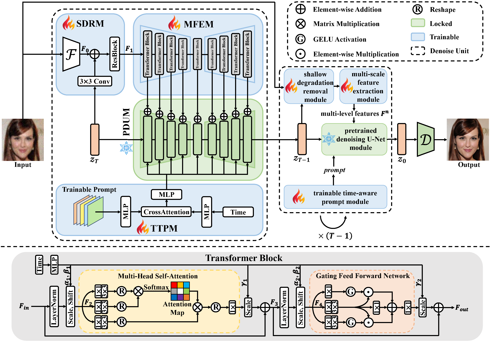
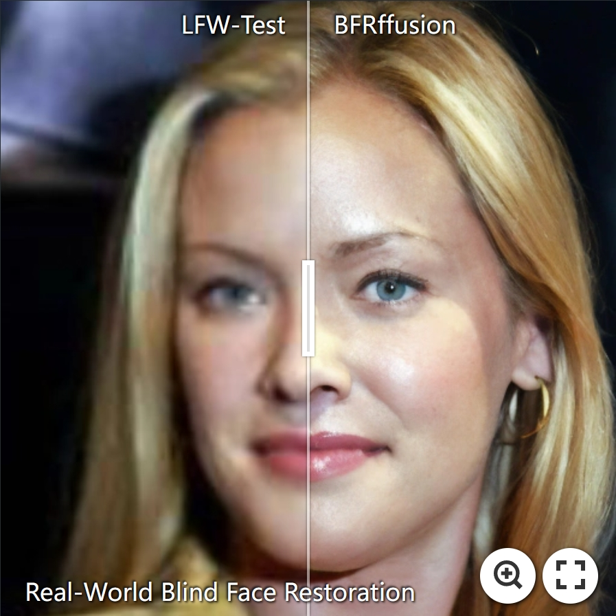
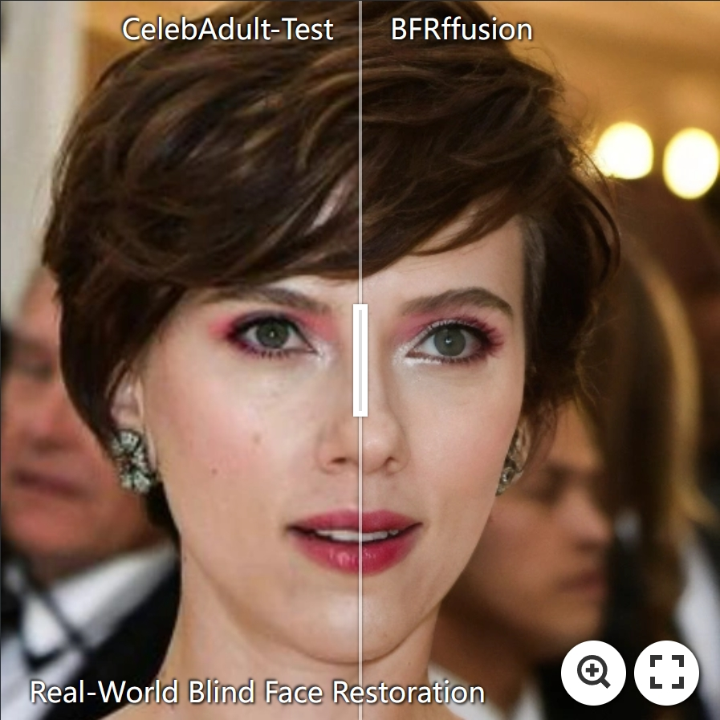
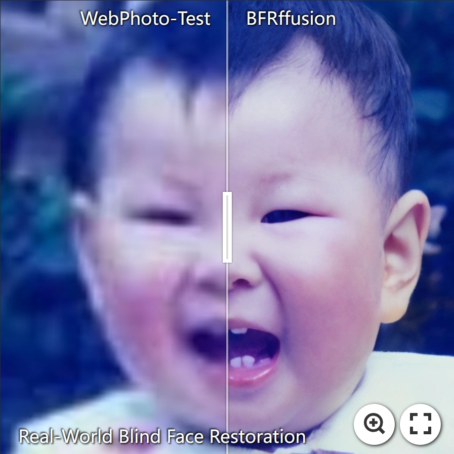
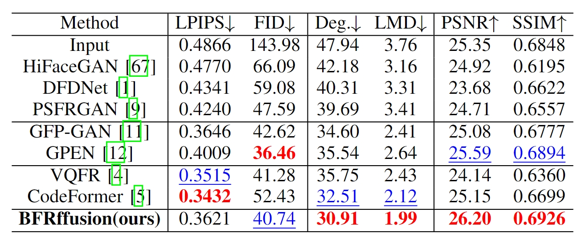

<h1 align="center">Towards Real-World Blind Face Restoration with Generative Diffusion Prior</h1>

[](https://arxiv.org/abs/2312.15736)

Xiaoxu Chen, Jingfan Tan, Tao Wang, [Kaihao Zhang](https://zhangkaihao.github.io/), [Wenhan Luo](https://whluo.github.io/), [Xiaochun Cao](https://scst.sysu.edu.cn/members/caoxiaochun.htm)

**Keywords**: blind face restoration, face dataset, diffusion model, transformer

**Abstracts**: Blind face restoration is an important task in computer vision and has gained significant attention due to its wide-range applications. Previous works mainly exploit facial priors to restore face images and have demonstrated high-quality results. However, generating faithful facial details remains a challenging problem due to the limited prior knowledge obtained from finite data. In this work, we delve into the potential of leveraging the pretrained Stable Diffusion for blind face restoration. We propose BFRffusion which is thoughtfully designed to effectively extract features from low-quality face images and could restore realistic and faithful facial details with the generative prior of the pretrained Stable Diffusion. In addition, we build a privacy-preserving face dataset called PFHQ with balanced attributes like race, gender, and age. This dataset can serve as a viable alternative for training blind face restoration networks, effectively addressing privacy and bias concerns usually associated with the real face datasets. Through an extensive series of experiments, we demonstrate that our BFRffusion achieves state-of-the-art performance on both synthetic and real-world public testing datasets for blind face restoration and our PFHQ dataset is an available resource for training blind face restoration networks.




## :book: Table Of Contents
- [:book: Table Of Contents](#book-table-of-contents)
- [:camera: Demo on Real-World Blind Face Restoration](#camera-demo-on-real-world-blind-face-restoration)
- [:house: Installation](#house-installation)
- [:zap: Quick Inference](#zap-quick-inference)
- [:computer: Training](#computer-training)
- [:straight\_ruler: Evaluation](#straight_ruler-evaluation)
- [:chart\_with\_upwards\_trend: Results](#chart_with_upwards_trend-results)
- [:framed\_picture: PFHQ](#framed_picture-pfhq)
- [:clipboard: Citation](#clipboard-citation)
- [:sparkles: Acknowledgement](#sparkles-acknowledgement)
- [:e-mail: Contact](#e-mail-contact)

## :camera: Demo on Real-World Blind Face Restoration
[](https://imgsli.com/MjI4NzY1) [](https://imgsli.com/MjI4NzY3) [](https://imgsli.com/MjI4NzY4)


## :house: Installation
A suitable [conda](https://conda.io/) environment named `BFRffusion` can be created and activated with:
```
# clone this repository
git clone https://github.com/chenxx89/BFRffusion
cd BFRffusion

# create new anaconda env
conda env create -f environment.yaml
conda activate BFRffusion
```
You can install `xformers` for more efficiency and speed on GPUs. For more details you can visit [xformers](https://github.com/facebookresearch/xformers) and [stablediffusion](https://github.com/Stability-AI/stablediffusion).

## :zap: Quick Inference
Download pre-trained models from [BaiduNetdisk](https://pan.baidu.com/s/1w3R9TuqmpAbP0tsMsGLOZA?pwd=r89i) or [OneDrive](https://mail2sysueducn-my.sharepoint.com/:u:/g/personal/chenxx89_mail2_sysu_edu_cn/EbMHkGqhYUVDndHy5fVlNo4BVMAZ3161X9FR_T_utTYuCA) to the `experiments/weights` folder. 


**Inference!**

```bash
# for real-world image
python inferience.py --input inputs -output results --sr_scale 2
```
```bash
# for cropped face
python inferience.py --input inputs -output results --sr_scale 2 --aligned
```

```console
Usage: python inferience.py --input inputs -output results --sr_scale 2 [options]...

  --input             Input image or folder. Default: inputs/whole_imgs
  --output            Output folder. Default: results
  --ckpt               The dir of ckpt to load
  --config             Path to config which constructs model
  --ddim_steps         Number of ddpm sampling steps
  --only_center_face    Only restore the center face
  --ext                 Image extension. Options: auto | jpg | png, auto means using the same extension as inputs. Default: auto
  --aligned             Input are aligned faces
  --sr_scale           The final upsampling scale of the image. Default: 2
  --bg_upsampler        background upsampler. Default: realesrgan
  --bg_tile             Tile size for background sampler, 0 for no tile during testing. Default: 400
  --suffix              Suffix of the restored faces
```

## :computer: Training

We provide the training codes used in our paper for `BFRffusion`. <br>
You could improve it according to your own needs.

1. Dataset preparation: [FFHQ](https://github.com/NVlabs/ffhq-dataset)
2. Download pre-trained Stable Diffusion 2.1-base from [Hugging Face](https://huggingface.co/stabilityai/stable-diffusion-2-1-base/blob/main/v2-1_512-ema-pruned.ckpt) to the `experiments/weights` folder
3. Modify the configuration file `options/train.yaml` accordingly
4. Training
```bash
python train.py
```

## :straight_ruler: Evaluation

We evaluate BFRffusion on the synthetic dataset `CelebA-Test`, and three real-world datasets `LFW-Test`, `CelebAdult-Test` and `Webphoto-Test`. For reproduce our evaluation results, you need to perform the following steps:

1. Download testing datasets by the following links:

|Dataset|Usage|Quantity|Type|
|:----:|:----:|:----:|:----:|
|[CelebA-Test](https://xinntao.github.io/projects/gfpgan)|testing|3,000|paired synthetic dataset|
|[LFW-Test](https://xinntao.github.io/projects/gfpgan)|testing|1,711|non-paired real-world dataset|
|[CelebAdult-Test](https://xinntao.github.io/projects/gfpgan)|testing|180|non-paired real-world dataset|
|[WebPhoto-Test](https://xinntao.github.io/projects/gfpgan)|testing|407|non-paired real-world dataset|


2. Download pretrained models for different metrics, and put them to `experiments/weights`

<table>
<tr>
    <th>Metrics</th>
    <th>Pretrained Weights</th>
    <th>Download</th>
</tr>
<tr>
    <td>FID</td>
    <td>inception_FFHQ_512.pth</td>
    <td rowspan="3"><a href="https://pan.baidu.com/s/1u-d3xfcszKgPJ-4e6nL7Aw?pwd=y9h3">BaiduNetdisk</a> </td>
</tr>
<tr>
    <td>Deg</td>
    <td>resnet18_110.pth</td>
</tr>
<tr>
    <td>LMD</td>
    <td>alignment_WFLW_4HG.pth</td>
</tr>
</table>

3. Generate restoration results:

- Specify the dataset_lq/dataset_gt to the testing dataset root in `options/test.yaml`

- We use `multiprocessing` to test on multi-GPUs, please reset `--gpu_ids`

- Then run the following command:
```bash
    python test.py
```
You can download our testing results from [BaiduNetdisk](https://pan.baidu.com/s/17SZalfAUTZNl2AFafkOplg?pwd=abdv) or [OneDrive](https://mail2sysueducn-my.sharepoint.com/:f:/g/personal/chenxx89_mail2_sysu_edu_cn/EnlJtXJnYS1Kl_JWrVnI2XIB4SJRmazUXRyTUpkpryZusw).

4. Run evaluation:
```bash
    # LPIPS|PSNR/SSIM|LMD|Deg.
    python metrics/[calculate_lpips.py|calculate_psnr_ssim.py|calculate_landmark_distance.py|calculate_cos_dist.py]
    -restored_folder folder_to_results -gt_folder folder_to_gt

    # FID
    python metric_paper/calculate_fid_folder.py -restored_folder folder_to_results
```
For more testing details, you can visit [VQFR](https://github.com/TencentARC/VQFR)

## :chart_with_upwards_trend: Results



Quantitative comparison on `CelebA-Test` for blind face restoration. <span style="color:red; font-weight:bold;">Red</span> and <span style="color:blue; text-decoration:underline;">Blue</span> indicate the best and the second-best performance.

## :framed_picture: PFHQ 
We build a privacy-preserving paired face dataset called `PFHQ` with balanced race, gender, and age. Extensive experiments show that our PFHQ dataset can serve as an alternative to real-face datasets for training blind face restoration methods. Following are some representative face images of our proposed PFHQ dataset. You can download our PFHQ from [BaiduNetdisk](https://pan.baidu.com/s/1UlkeD5EnAecKRkciHdaOKw?pwd=p7nx).


## :clipboard: Citation

If our work is useful for your research, please consider citing:

```
@misc{chen2023realworld,
      title={Towards Real-World Blind Face Restoration with Generative Diffusion Prior}, 
      author={Xiaoxu Chen and Jingfan Tan and Tao Wang and Kaihao Zhang and Wenhan Luo and Xiaocun Cao},
      year={2023},
      eprint={2312.15736},
      archivePrefix={arXiv},
      primaryClass={cs.CV}
}
```

## :sparkles: Acknowledgement

- This project is based on [Controlnet](https://github.com/lllyasviel/ControlNet), and [Restormer](https://github.com/swz30/Restormer).

- Some codes are brought from [BasicSR](https://github.com/XPixelGroup/BasicSR), and [arcface-pytorch](https://github.com/ronghuaiyang/arcface-pytorch).

- This Readme is inspired by [RobustSIRR](https://github.com/ZhenboSong/RobustSIRR), and [VQFR](https://github.com/TencentARC/VQFR).

## :e-mail: Contact

If you have any questions, please feel free to reach out at `chenxx89@mail2.sysu.edu.cn`.
